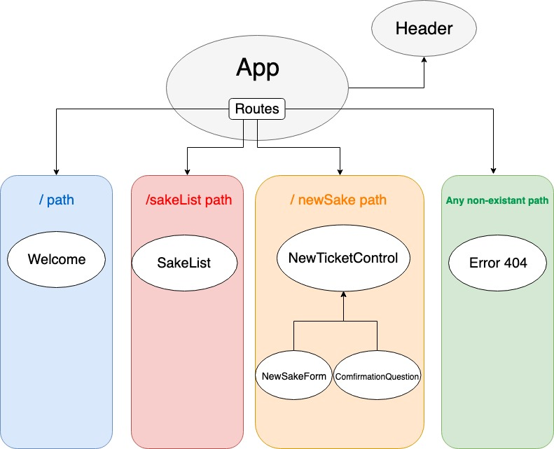

### _Marai Distillery_

#### _User can view a list of available sake_

#### _By Kohichi Horii_

## Description

* _The purpose of this project is to have a user see which sake is available, brand, price and alcohol content_

## Planning

## Installation

1. Go to terminal and clone this repository:
`$ git clone git repository link:` [github repository](https://github.com/ko1h/mirai-tap-room.git).

2. Change into the project directory and install npm:
`$ npm install`

3. Build the app:
`$ npm run strart`

4. Open browser:
`Navigate to http://localhost:8080/ in your browser to see the page.`

## Completed Features
* _Program will navigate between different pages_
* _Program will take a new sake entree and show it in sake list_

## Planned Features

* _Have the user be able to import a photo with the new sake information_
* _Add animation when customer hovers over images and also links_
* _User will be able to edit if the sake is no longer available_
* _User will be able to purchase an item, will make a checkout component_

## Known Bugs

_No known bugs at this time._

## Support and contact details

_If you are having issues you can contact us at kohichi.horii@gmail.com_

## Technologies Used

_React, JSX, Webpack, Hot Module Replacement, Git, ES6, Babel_

### License

*This software is licensed under the MIT license.*

Copyright (c) 2019 **_KH_** MIT license.
